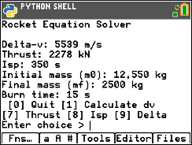

# Rocket Equation Calc

Rocket Equation Calc shares a small python program rocket.py, which solves Tsiolkovsky's rocket equation.

$
\Delta v = v_e \ln (\frac{m_0}{m_f})
$

$\Delta v$: the delta velocity
$v_e$: the exhaust velocity
$m_0$: the initial mass of the rocket (including fuel)
$m_f$: the final mass of the rocket
$\ln$: the natural logarithm function




ROCKETS.py calculates the rocket fomura on TI-84 Python.

## Prompt

```
Rocket Equation Solver

Delta-v: 5,540 m/s
Thrust: 2,278 kN
Isp: 350 s
Initial mass (m0): 12,550 kg
Final mass (mf): 2,500 kg
Burn time: 15 s
```

Below this prompt, ROCKET.py asks you which parameter you want to caluculate of set.

```
[0] Quit: Quit this program
[1] Calculate dv: Calculating with setting all parameters
[7] Thrust: Setting engine thrust power in unit N
[8] Isp: Setting the exhaust velocity in unit s
[9] Delta: Display cosmic velocity
```
